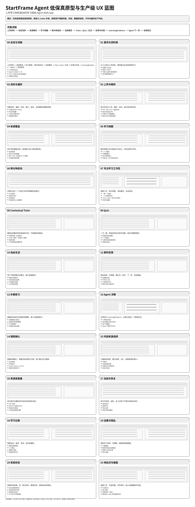

# 04 低保真原型使用说明

## 为什么需要先有完整原型

本产品包含来源、会话、Tutor、练习、反馈、Agent、搜索和恢复等多个状态。没有完整原型就直接开发，Codex 容易：

- 把 Agent 与 Tutor 职责混在一起
- 漏掉异常状态
- 将所有功能塞进一个页面
- 忽略移动端、键盘和保存恢复
- 使用不一致的按钮和数据结构

因此，先确定完整 UI/UX 原型再开发更好。

## 可点击原型

打开：

`prototype/startframe_lowfi_prototype.html`

它包含 19 个可切换视图，覆盖主流程与代表性恢复分支。已删除独立的开始前测试和大屏来源查看器；来源改为讲解内的轻量引用。生产状态完整清单以 05、06、11、12 和 evals 为准。

## 全页面总览

## Codex 应如何使用

Codex 在每个前端里程碑开始前必须：

1. 阅读对应屏幕的 HTML 结构。
2. 阅读 `05_SCREEN_AND_INTERACTION_SPEC_CN.md`。
3. 阅读组件和状态规范。
4. 先列出它将实现的页面、组件和状态。
5. 实现后用浏览器逐个操作对应流程。

## 原型不是生产代码

原型 HTML：

- 只用于表达布局、内容层级和交互关系
- 使用内联 CSS/JS 以便单文件打开
- 不代表最终目录、API 或状态管理方式
- 不得直接部署为最终应用

## 图像放置位置

总览图放在：

`prototype/startframe_lowfi_overview.png`

Markdown 通过相对路径引用，整个文件夹打开后 Codex 可以同时读取文字和图像。不要单独把 PNG 发给 Codex。
